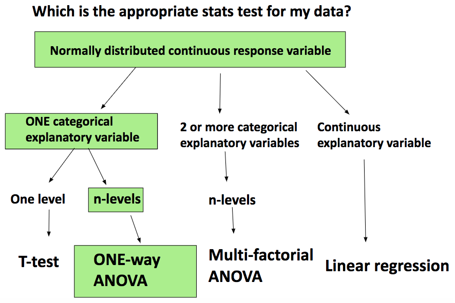
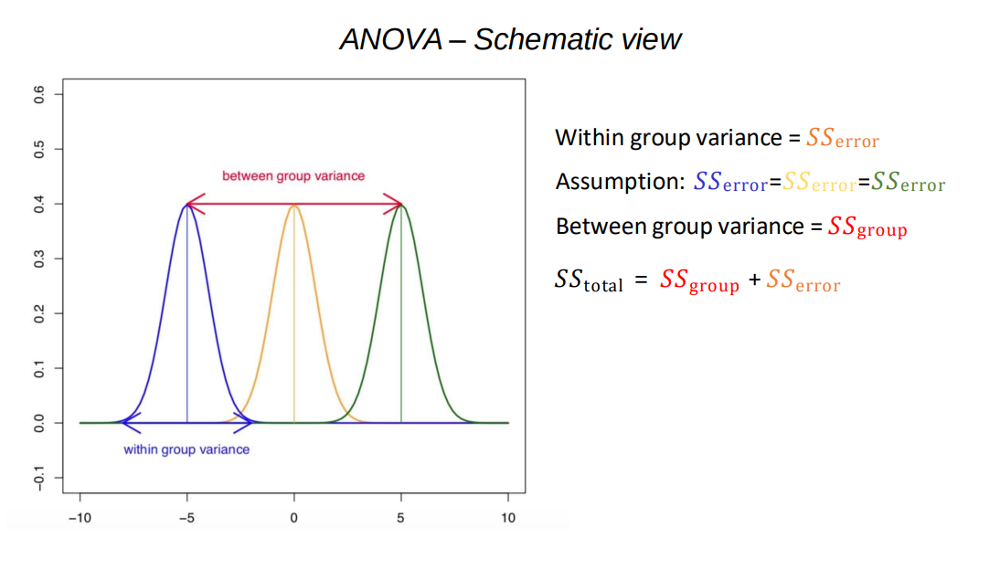
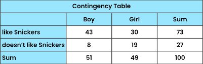
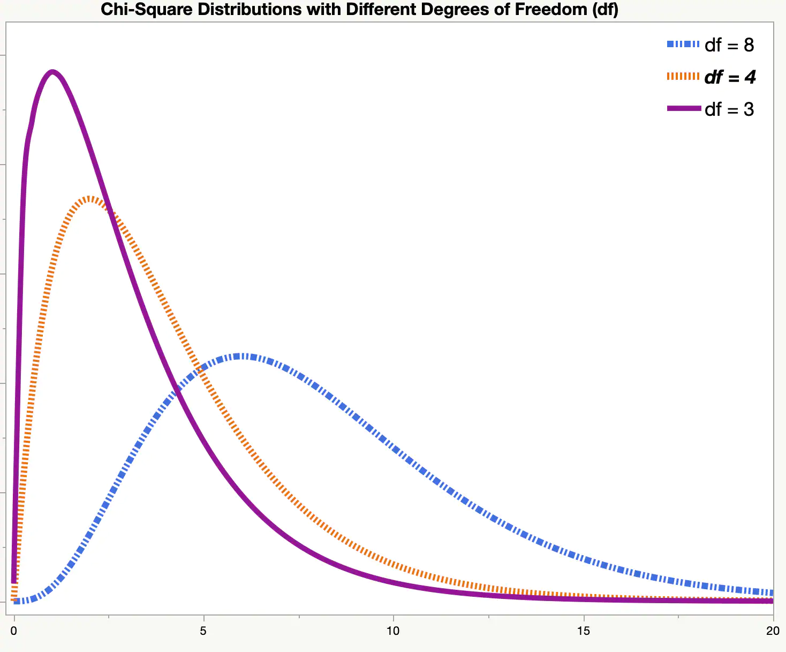
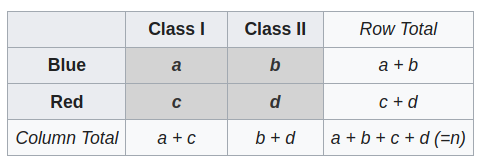
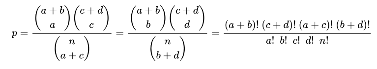

```{r setup, include=FALSE}
knitr::opts_chunk$set(echo = TRUE)
```

## Introduction to statistics in R course (day 2)

```{r}
# imports 
library(tidyverse)
library(patchwork)
library(dplyr)
library(ISwR) # Introductory Stat w R
library(cluster)
library(ggplot2)
library(ggpubr)
library(rstatix)
library(pheatmap)
# install if not already installed
if(!require(pwr)){
    install.packages("pwr")
    library(pwr)
}
```

#### Multiple sample tests: ANOVA, Tukey post-hoc test, Kruskal-Wallis

{width="502"}

How to statistically compare the mean of more than two groups?

-   we can do multiple t-tests with multiple testing correction

<!-- -->

-   we can do ANOVA - ANalysis Of VAriance → allows to do determine whether there are any statistically significant differences between the means of three or more independent groups. It compares variation between groups to variation within groups to determine whether the observed differences are due to chance or not.

Null hypothesis: all group means are equal;

Alternative hypothesis: at least one mean is different.

{width="861"}

**Task**: run the ANOVA on `PlantGrowth.csv` data to determine if these groups (ctrl, trt1, trt2) differ from each other.

Read in the data (the file is in the Github repo under data folder and summarize the groups visually using a violin plot.

```{r}
# TODO: finish this function with your file path to PlantGrowth.csv
#PlantGrowth <- read.csv("", header = T)

# TODO: show the different groups using a violin plot 
```

Now check if the assumptions are met for ANOVA:

-   Data in every treatment group (ctrl, trt1, trt2) is normally distributed (hint: `shapiro_test`)

-   Equal/homogeneous within group variance (hint: `levene_test`)

```{r}

```

Here is a Q-Q plot for all of the groups.

```{r}
# Create Q-Q plots with facets
ggplot(PlantGrowth, aes(sample = weight)) +
  stat_qq() +
  stat_qq_line() +
  facet_wrap(~ group) +
  labs(
    title = "Q-Q Plots of Weight by Group",
    x = "Theoretical Quantiles",
    y = "Sample Quantiles"
  ) 
```

Now let's run the ANOVA test (hint: `aov()`) and take a look at the summary of the test.

```{r}

```


If the p-value indicates a significant result, you can follow up with post-hoc tests to identify which groups are significantly different.

For performing multiple pairwise comparisons between groups, Tukey post-hoc test is often used (HSD = honestly significant difference, hint: use `TukeyHSD`). Plot the output of `TukeyHSD` using the built-in `plot()`.

```{r}

```

Confidence interval (C.I.) interpretation: 95% C.I. means that true estimate of effect (difference in means) lies within 2 standard errors (SE) of the population mean 95 times out of 100.

$$
SE = \frac{s}{\sqrt{n}} \newline 
s = \sqrt{\frac{1}{n-1} \sum_{i=1}^n (x_i - \bar{x})^2} \newline
\bar{x} = \frac{1}{n} \sum_{i=1}^n x_i
$$

where $s$ is the sample standard deviation, $n$ is the sample size, and $\bar{x}$ is the sample mean.

If any of the ANOVA assumptions (independent observations, equal variance, normal distribution) are not met: non-parametric alternative is the Kruskal-Wallis (`kruskal_test` can be used for this)

```{r}
#kruskal_test(PlantGrowth, weight ~ group)
```

NB! while doing multiple pairwise comparisons, you need to correct the p-value (either by Bonferroni, Holm etc., the approaches were covered on Day 1)

What if you want to estimate the combined effect (i.e. you have more than one variable) of some parameters on weight (such as treatment type and concentration)? Multi-factorial ANOVA is the way to go.

You can use \* to combine different parameters e.g. aov(weight \~ treatment_group \* concentration).

#### **Correlation and regression**: Pearson, Spearman (rank), Kendal (rank), linear/polynomial regression, linear mixed models.

Theory: <https://zenodo.org/records/14918657/files/Correlation_and_simple_reg_25.pdf?download=1>

**Task**: Find the correlation between the two columns (velocity and glucose) in the data set `thuesen`. Test with the suitable correlations. What parameter do you have to add to avoid getting the error message? (for NA values)

```{r}
data(thuesen)
?thuesen
head(thuesen)
```

Check the assumption for Pearson correlation:

-   the data follows a bivariate normal distribution

```{r}

```

Is the assumption met?

Run different correlations to assess relations between the 2 features.

```{r}

```

Visualize the dependence of velocity on glucose (independent variable) using a scatter plot.

```{r}

```

**Linear regression**

Let's find the regression line for this relationship.

```{r}

```

Now standardize glucose and find the linear model again (check out `scale` for this)

**What is standardization?**

Standardization is done by scaling the independent/predictor variable. When variables are on very different scales (not necessarily the case here), it can lead numerical instability. Standardizing also leads to better interpretation of model coefficients, they show the relative importance of each predictor variable in terms of standard deviations instead of raw units.

```{r}

```

Let's plot this last regression line on the scatter plot.

```{r}
ggplot(thuesen, aes(y=velocity, x=glucose)) +
  geom_point() +
  geom_smooth(method="lm")
  theme_minimal()
```

The dark gray region indicates the 95% CI for the regression line, to remove this you can use `se = FALSE` in the `geom_smooth` function.

Let's take a look at the summary of the regression line.

```{r}
#summary()
```

**Task**: Try to make sense of the output above by answering the following questions:

1) What are residuals in linear regression?

Answer:

2) What does the p-value for the slope (glucose) mean?

Answer:

3) How to determine the degrees of freedom?

Answer:

4) What is the residual standard error? Could you obtain the same value as in the summary by re-creating the formula in the code block below?

Answer:

```{r}

```

5) What are multiple R-squared, adjusted R-squared, F-statistic?

Answer:

**Polynomial regression**

**Task**: fit a polynomial regression model on the same `thuesen` dataset (hint: make use of `poly`)

```{r}

```

In some cases polynomial regression is more important than in other cases. Let's look at an example below.

```{r}
data(iris)

# Fit a linear model
linear_model <- lm(Sepal.Length ~ Sepal.Width, data = iris)

# Fit a polynomial regression model
poly_model <- lm(Sepal.Length ~ poly(Sepal.Width, 5), data = iris)

# Create predictions for the linear and polynomial models
iris$pred_linear <- predict(linear_model, iris)
iris$pred_poly <- predict(poly_model, iris)

# Display summary of both models to compare R-squared and Adjusted R-squared
summary(linear_model)
summary(poly_model)

# Plot using ggplot
ggplot(iris, aes(x = Sepal.Width, y = Sepal.Length)) +
  geom_point(aes(color = Species)) +  # Actual data points
  geom_line(aes(y = pred_linear), color = 'red', size = 1, linetype = "dashed") +  # Linear regression line
  geom_line(aes(y = pred_poly), color = 'green', size = 1) +  # Polynomial regression line
  labs(title = "Polynomial Regression vs Linear Regression",
       x = "Sepal Width (cm)",
       y = "Sepal Length (cm)") +
  theme_minimal()
```

Recall ANOVA? ANOVA is a special case of linear regression where you treat the group membership as categorical predictor. Let's take a look back at our PlantGrowth dataset.

```{r}
model_anova_lm <- lm(weight ~ group, data = PlantGrowth)

# Summary of the model to view p-value for group comparison, 
# here the intercept is ctrl
summary(model_anova_lm)
```

**Briefly about linear mixed models**

Let's look at this example: <http://mfviz.com/hierarchical-models/>

Mixed model is a model that takes into account fixed and random effects (in biology, these might be experimental repeats, drug intake by humans).

This implementation requires a strong understanding of the phenomenon you are modeling.

When should I use this? As biological data can be complex and messy, small sample sizes are not always sufficient enough to fit complicated models with many parameters. Data points might not always be truly independent (correlated or hierarchical). You could take the average of each group and evaluate the difference with a statistical test, but this is not covering the data well at all. You could also do separate linear regression models for each comparison, but the models will be noisy and do not take advantage of data from other groups.

#### Categorical data in statistics

What are examples of categorical data in your work?

Categorical data may derive from observations of quantitative data. They can be ordinal or nominal. The data are often summarized in the form of a contigency table. Something like this below.



Categorical data cannot be ordered, or otherwise manipulated as numbers can be.

#### Dealing with data in contingency tables

Chi-squared test (also chi-square or χ2 test)

$$
\chi^2 = \sum_{i=1}^{r} \sum_{j=1}^{c} \frac{(O_{ij} - E_{ij})^2}{E_{ij}}
$$

where $\chi^2$ is the Chi-Square statistic, $r$ is the number of rows (categories of variable 1), $c$ is the number of columns (categories of variable 2), and $O_{ij}$ is the observed frequency in the $i^{th}$ row and $j^{th}$ column and $E_{ij}$ is the expected frequency in the $i^{th}$ row and $j^{th}$ column.



<https://www.jmp.com/en_gb/statistics-knowledge-portal/chi-square-test/chi-square-distribution.html>

The assumptions:

-   used when sample sizes are large

    -   ideally, all expected cell frequencies should be \>= 5 (else, use the Fisher's exact test or combine categories if possible)

-   the categorical variables are independent in influencing the test statistic:

    -   no individual/item should be in multiple categories

Null hypothesis: no significant association between the variables in the population, the variables are independent (the test statistic computed follows a χ2 frequency distribution, shows how likely the observed frequencies would be)

Alternative hypothesis: the variables are dependent. Knowing the value of one variable helps to predict the value of the other variable

Example scenario: Suppose you want to test whether there is an association between gender (Male, Female) and preference for a product (Like, Dislike).

Let's create a contingency table:

```{r}

# Create a contingency table (Gender vs Product Preference)
# Rows: Gender (Male, Female)
# Columns: Product Preference (Like, Dislike)

data <- matrix(c(30, 10, 20, 40), nrow = 2, byrow = TRUE)
rownames(data) <- c("Male", "Female")
colnames(data) <- c("Like", "Dislike")

# View the contingency table
print("Contingency Table:")
print(data)
```

Now let's run a Chi-Square test.

```{r}
# Perform the Chi-Square Test
chi_result <- chisq.test(data)

# Output the test results
print("Chi-Square Test Result:")
print(chi_result)
```

Interpreting the output:

-   χ2-statistic

-   degrees of freedom: amount of different categories - 1

-   p-value:

    -   if p-value \< 0.05: significant association between gender and preference;

    -   else, no significant association

If you want to check the expected frequencies for the Chi-Square test, you can run:

```{r}
chi_result$expected
```

For each cell this equals to finding the product of the row ($i$) and column ($j$) total that is divided by the grand total of frequencies:

$$
E_{ij} = \frac{(\text{Row Total})_i \times (\text{Column Total})_j}{\text{Grand Total}}
$$

**​Task**: Determine if there is a statistical association in between petal length and plant species in the `iris` data set.

```{r}
# Load the iris dataset
data(iris)
```

Categorize petal length to meet the assumptions of the Chi-Square Test.

```{r}

```

Create a contingency table and perform the Chi-Square Test.

```{r}

```

#### Fisher's exact test 

You would want to use the Fisher's exact test for the following reasons:

-   Cell counts are smaller than 20

-   A cell has an expected value 5 or less.

-   The column or row marginal values (totals) are extremely uneven.

The Fisher's exact test calculates the probability for the p-value by finding the proportion of possible tables that are more extreme than the observed table.





The hypotheses are the same than for the Chi-square test.

It can also be used to quantify the overlap between two sets. For examples, in gene enrichment analyses, one set of genes may be annotated for a given phenotype and the user may be interested in testing the overlap of their own set with those.

In this case a 2 × 2 contingency table may be generated and Fisher's exact test applied through identifying: genes that are provided in both lists, genes that are provided in the first list and not the second, genes that are provided in the second list and not the first, genes that are not provided in either list.

This test assumes genes in either list are taken from a broader set of genes (all remaining genes). A p-value shows the significance of the overlap between the two lists (this test is used e.g. in <https://biit.cs.ut.ee/gprofiler/gost>).

Example overview: A British woman claimed to be able to distinguish whether milk or tea was added to the cup first. To test, Ronald Fisher gave her 8 cups of tea, in four of which milk was added first. The null hypothesis is that there is no association between the true order of pouring and the woman's guess, the alternative, that there is a positive association.

```{r}
TeaTasting <-
matrix(c(3, 1, 1, 3),
       nrow = 2,
       dimnames = list(Guess = c("Milk", "Tea"),
                       Truth = c("Milk", "Tea")))

TeaTasting

tea_fisher <- fisher.test(TeaTasting, alternative = "greater")
tea_fisher
```

What does the **odds ratio** show?

The odds ratio (OR) is the ratio of the odds of event A taking place in the presence of B, and the odds of A in the absence of B. Due to symmetry, odds ratio reciprocally calculates the ratio of the odds of B occurring in the presence of A, and the odds of B in the absence of A.

Let's find the odds of guessing Milk correctly (Guess = Milk and Truth = Milk):

```{r}
# A = correct guess for milk / incorrect guesses for milk
```

Let's find the odds of guessing Tea correctly (Guess = Tea and Truth = Tea):

```{r}
# B = correct guess for tea / incorrect guesses for tea
```

The odds ratio compares the odds of guessing Milk correctly to the odds of guessing Tea correctly.

```{r}
# OR = A/B
```

Two events are independent if and only if the OR equals 1, i.e., the odds of one event are the same in either the presence or absence of the other event.

If the OR is greater than 1, then A and B are associated (correlated) in the sense that, compared to the absence of B, the presence of B raises the odds of A, and symmetrically the presence of A raises the odds of B.

Conversely, if the OR is less than 1, then A and B are negatively correlated, and the presence of one event reduces the odds of the other event occurring.

This measure is also often used in case-control studies.

**Task:** Let X be a journal, say either Mathematics Magazine or Science, and let Y be the number of articles on the topics of mathematics and biology appearing in a given issue of one of these journals. If Mathematics Magazine has five articles on math and one on biology, and Science has none on math and four on biology. Determine if there is an association between the journal and the topic.

```{r}

```

#### Give feedback to this 2-day training: <https://forms.gle/CPWr9f4gJbA6fyij8>
